# Paws on Codex 🐾

> Real companion animals, reimagined as soft 3D Tamagotchi-style Codex pets.

[](https://github.com/yeony-park/paws-on-codex)
[](#meet-the-pets)
[](LICENSE)
[](ASSETS-LICENSE.md)

**English** · [한국어](docs/ko/README.md) · [日本語](docs/ja/README.md) · [简体中文](docs/zh-CN/README.md) · [Español](docs/es/README.md) · [Deutsch](docs/de/README.md) · [हिन्दी](docs/hi/README.md) · [Français](docs/fr/README.md) · [Português (Brasil)](docs/pt-BR/README.md) · [Русский](docs/ru/README.md)

<p align="center">
  
</p>

## Why this exists

I wanted the companion animals I live with—not a generic cat—to sit beside me while I code. Paws on Codex began as recognizable 3D virtual-pet versions of Chapssari and Mandu, preserving their real faces, coat colors, markings, proportions, and tails while translating them into a bright, soft retro game style.

The repository now also gives other guardians a small, repeatable path for introducing a companion, sharing one photo, and creating an installable Codex pet.

## The real cats behind the pixels

| Chapssari · 찹쌀이 | Mandu · 만두 |
| --- | --- |
| 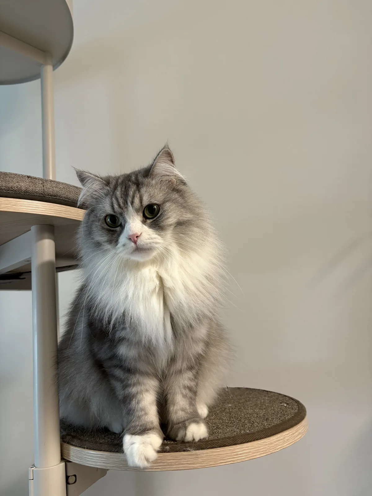 | 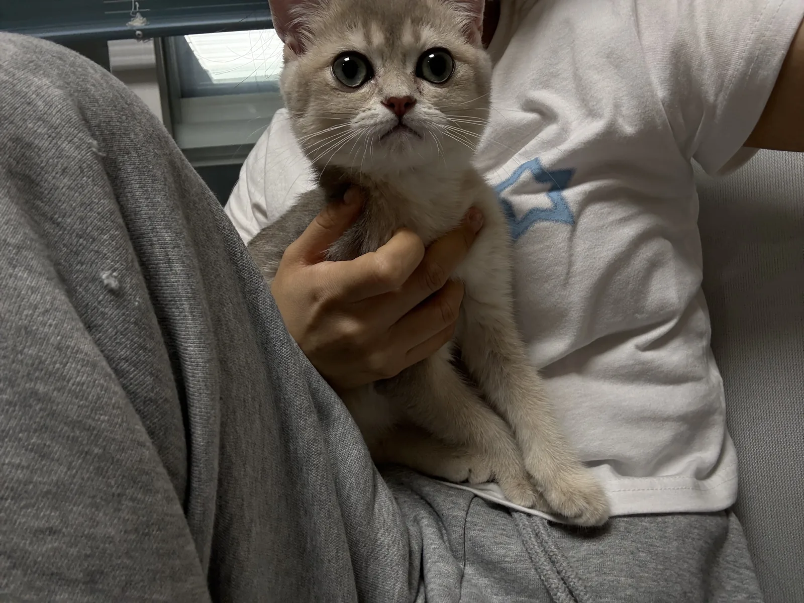 |
| Long-haired, silver-gray and white, with a generous unstriped plume tail. | A five-month-old taupe-gray and cream British Shorthair kitten, curious about everything. |

## Quick install

### macOS / Linux

```bash
# Chapssari
curl -fsSL https://raw.githubusercontent.com/yeony-park/paws-on-codex/main/install.sh | bash -s -- chapssari

# Mandu
curl -fsSL https://raw.githubusercontent.com/yeony-park/paws-on-codex/main/install.sh | bash -s -- mandu
```

List available pets:

```bash
curl -fsSL https://raw.githubusercontent.com/yeony-park/paws-on-codex/main/install.sh | bash -s -- --list
```

### Windows PowerShell

```powershell
# Chapssari
powershell -NoProfile -ExecutionPolicy Bypass -Command "& ([scriptblock]::Create((irm 'https://raw.githubusercontent.com/yeony-park/paws-on-codex/main/install.ps1'))) chapssari"

# Mandu
powershell -NoProfile -ExecutionPolicy Bypass -Command "& ([scriptblock]::Create((irm 'https://raw.githubusercontent.com/yeony-park/paws-on-codex/main/install.ps1'))) mandu"
```

The default destination is `~/.codex/pets/<pet-name>/`, or the equivalent path under `CODEX_HOME`. Refresh or restart Codex after installation.

## Meet the pets

| Chapssari · 찹쌀이 | Mandu · 만두 |
| --- | --- |
| 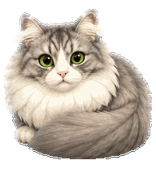 |  |
| A Norwegian Forest cat with abundant silver-gray fur, a broad white tuxedo, green eyes, and a huge unstriped plume tail. | A curious, energetic British Shorthair kitten with subtle taupe-gray and creamy-white fur, blue-green eyes, and a compact round build. |

## Motion gallery

| Pet | Idle | Waving | Running | Waiting | Review |
| --- | --- | --- | --- | --- | --- |
| **Chapssari** |  | 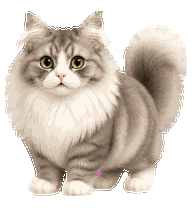 | 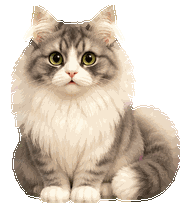 | 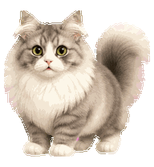 | 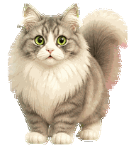 |
| **Mandu** | 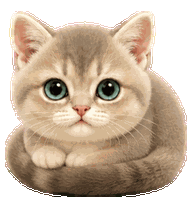 | 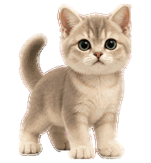 | 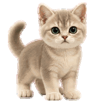 | 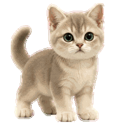 | 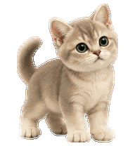 |

Each v2 package also contains left/right movement, jumping, failure reactions, and 16 look directions.

## Web upload · v1

Use these compatibility ZIP files when a web uploader accepts only the 8×9 v1 atlas. Each archive contains only `pet.json` and `spritesheet.webp`.

- [Chapssari v1 web upload ZIP](web-v1/chapssari-v1-web-upload.zip)
- [Mandu v1 web upload ZIP](web-v1/mandu-v1-web-upload.zip)

## Introduce your companion

You do not need a finished sprite sheet. Submit one single-line Markdown introduction and, optionally, one photo:

1. Copy [`community-pets/_template.md`](community-pets/_template.md) to `community-pets/github-id--pet-name.md`.
2. Write one non-empty line of no more than 180 characters.
3. Optionally add one JPG, PNG, or WebP photo as `community-pets/photos-inbox/github-id--pet-name.<ext>`.
4. Open a pull request.

```markdown
**Bori** · dog/Jindo · [@github-id](https://github.com/github-id) — A four-year-old explorer who reaches the front door before anyone can pick up the walking bag.
```

After merge, automation strips metadata, resizes the photo, converts it to WebP, removes the original upload, and updates the [community gallery](community-pets/GALLERY.md). See [CONTRIBUTING.md](CONTRIBUTING.md) for rights, privacy, and naming rules.

## Create your own pet with Codex

This repository includes the project skill [`$create-companion-pet`](.agents/skills/create-companion-pet/SKILL.md). Open the repository in Codex and ask:

```text
Use $create-companion-pet to turn these photos of my companion into a Codex pet.
```

The skill gathers an identity brief, invokes the installed `hatch-pet` workflow, produces a validated v2 package and v1 web package, and stages contribution metadata. A shorter standalone brief is also available in [`prompts/create-your-pet.md`](prompts/create-your-pet.md).

## Repository layout

```text
.
├── .agents/skills/create-companion-pet/
├── pets/
│   ├── chapssari/{pet.json,spritesheet.webp}
│   └── mandu/{pet.json,spritesheet.webp}
├── previews/
├── web-v1/
├── community-pets/
│   ├── photos-inbox/
│   └── photos/
├── docs/
├── scripts/
├── install.sh
├── install.ps1
├── CONTRIBUTING.md
├── LICENSE
└── ASSETS-LICENSE.md
```

## Acknowledgements

With thanks to [`legeling/awesome-codex-pet`](https://github.com/legeling/awesome-codex-pet): its motion-by-motion gallery presentation, one-command access, and community-first distribution model inspired this project. This repository's current implementation is independently written. If upstream MIT-licensed code is incorporated later, its copyright and permission notice must be preserved as described in [THIRD_PARTY_NOTICES.md](THIRD_PARTY_NOTICES.md).

## Contributors

Thanks to everyone who introduces a companion, improves a pet, translates documentation, or helps someone install one.

<a href="https://github.com/yeony-park/paws-on-codex/graphs/contributors">
  
</a>

## Star History

<a href="https://www.star-history.com/?type=date&repos=yeony-park%2Fpaws-on-codex">
 <picture>
   <source media="(prefers-color-scheme: dark)" srcset="https://api.star-history.com/chart?repos=yeony-park/paws-on-codex&type=date&theme=dark&legend=top-left&sealed_token=o0IJiSSZX6T_MmBNYLqJ4NVQ5LSJPV7KcZrQRvBzom2EZMf6_8yQlb5KTlqmi3jJ9_vl6ZBkzCBgLUTGhcH8u543gs1Oyt1eramLvwUjxTSXyd5et_iY7Sgkme5uIadIsm5yApWregMD-TtEdxAoaH-c9c8Sx4ZhMn4dQPlXtJ7BWwDqSl-IncLoZC5C" />
   <source media="(prefers-color-scheme: light)" srcset="https://api.star-history.com/chart?repos=yeony-park/paws-on-codex&type=date&legend=top-left&sealed_token=o0IJiSSZX6T_MmBNYLqJ4NVQ5LSJPV7KcZrQRvBzom2EZMf6_8yQlb5KTlqmi3jJ9_vl6ZBkzCBgLUTGhcH8u543gs1Oyt1eramLvwUjxTSXyd5et_iY7Sgkme5uIadIsm5yApWregMD-TtEdxAoaH-c9c8Sx4ZhMn4dQPlXtJ7BWwDqSl-IncLoZC5C" />
   
 </picture>
</a>

## License

- Code, scripts, and documentation: [MIT](LICENSE)
- Chapssari and Mandu pet assets and preview media: [CC BY-NC 4.0](ASSETS-LICENSE.md)
- Community photos and pet assets: the license declared by their contributor; CC BY-NC 4.0 is the default only when the contributor owns the necessary rights and accepts that license

The likenesses and names of real companion animals remain associated with their guardians. Reference photos are not relicensed unless they are explicitly included and marked.
