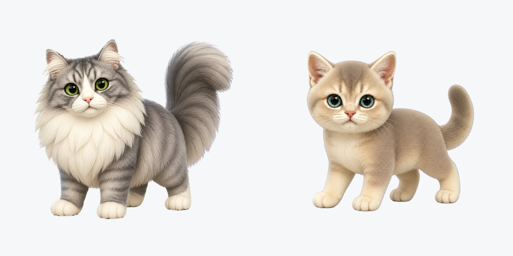

# Paws on Codex 🐾

[English](../../README.md) · [한국어](../ko/README.md) · [日本語](../ja/README.md) · [简体中文](../zh-CN/README.md) · [Español](../es/README.md) · [Deutsch](../de/README.md) · [हिन्दी](../hi/README.md) · **Français** · [Português](../pt-BR/README.md) · [Русский](../ru/README.md)

Des compagnons Codex 3D au style animal virtuel rétro, tout en conservant les traits reconnaissables de l'animal réel. Le projet est né de l'envie d'avoir des versions 3D de Chapssari et Mandu.

<p align="center"></p>

## Installation rapide

```bash
curl -fsSL https://raw.githubusercontent.com/yeony-park/paws-on-codex/main/install.sh | bash -s -- chapssari
curl -fsSL https://raw.githubusercontent.com/yeony-park/paws-on-codex/main/install.sh | bash -s -- mandu
```

L'installation se fait par défaut dans `~/.codex/pets/<pet-name>/`. Rechargez ou redémarrez Codex ensuite.

## Paquets v1 pour le Web

- [Chapssari v1 ZIP](../../web-v1/chapssari-v1-web-upload.zip)
- [Mandu v1 ZIP](../../web-v1/mandu-v1-web-upload.zip)

## Communauté

Ajoutez une présentation d'une seule ligne, limitée à 180 caractères, dans `community-pets/github-id--pet-name.md`. Vous pouvez déposer une photo portant le même nom de base dans `community-pets/photos-inbox/`. Après fusion, l'automatisation supprime les métadonnées, redimensionne, convertit en WebP et met à jour la [galerie](../../community-pets/GALLERY.md). Consultez [CONTRIBUTING.md](../../CONTRIBUTING.md).

Dans Codex, utilisez `$create-companion-pet` pour créer à partir de photos un paquet v2 validé et un paquet Web v1.

## Licence

Code, scripts et documentation : [MIT](../../LICENSE). Ressources et aperçus indiqués : [CC BY-NC 4.0](../../ASSETS-LICENSE.md).
