# Paws on Codex 🐾

> De vrais animaux de compagnie, réinterprétés en compagnons Codex au doux style 3D Tamagotchi.

[](https://github.com/yeony-park/paws-on-codex)
[](#meet-the-pets)
[](../../LICENSE)
[](../../ASSETS-LICENSE.md)

[English](../../README.md) · [한국어](../ko/README.md) · [日本語](../ja/README.md) · [简体中文](../zh-CN/README.md) · [Español](../es/README.md) · [Deutsch](../de/README.md) · [हिन्दी](../hi/README.md) · **Français** · [Português (Brasil)](../pt-BR/README.md) · [Русский](../ru/README.md)

Cette traduction reprend les mêmes informations d’installation, de compagnons et de contribution que le README anglais. Signalez les erreurs ou omissions dans une issue ou une PR.

<p align="center">
  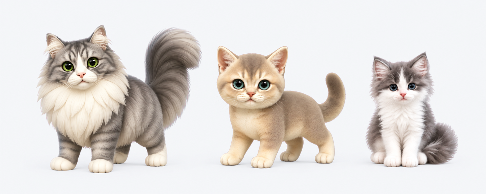
</p>

## Pourquoi ce projet existe

Je voulais que les animaux qui partagent ma vie, plutôt qu’un chat générique, restent près de moi pendant que je code. Le projet a commencé avec des versions 3D de Chapssari et Mandu, conservant leur visage, leurs couleurs, leurs marques, leurs proportions et leur queue dans un style de jeu rétro doux et lumineux.

Le dépôt propose désormais aux autres gardiens une démarche reproductible pour présenter un compagnon, partager une photo et créer un compagnon Codex installable.

## Les vrais chats derrière les pixels

| Chapssari | Mandu | Cho |
| --- | --- | --- |
| 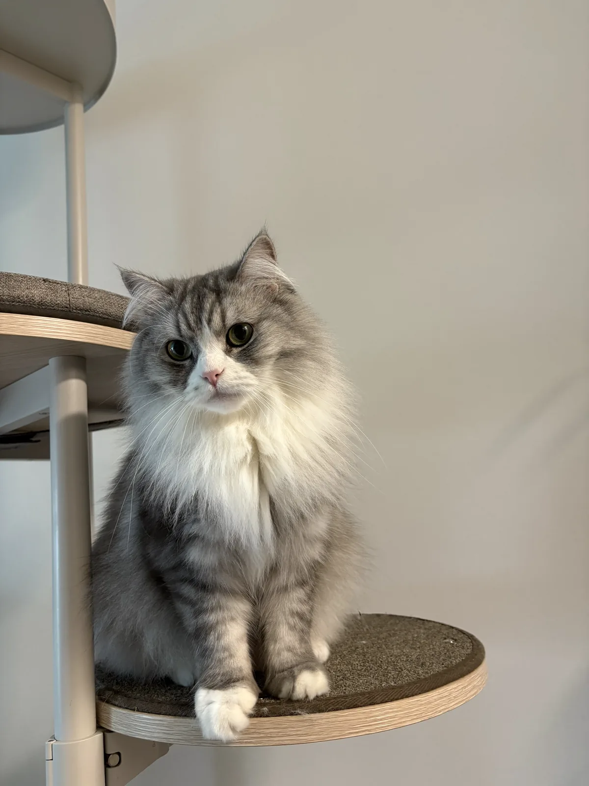 | 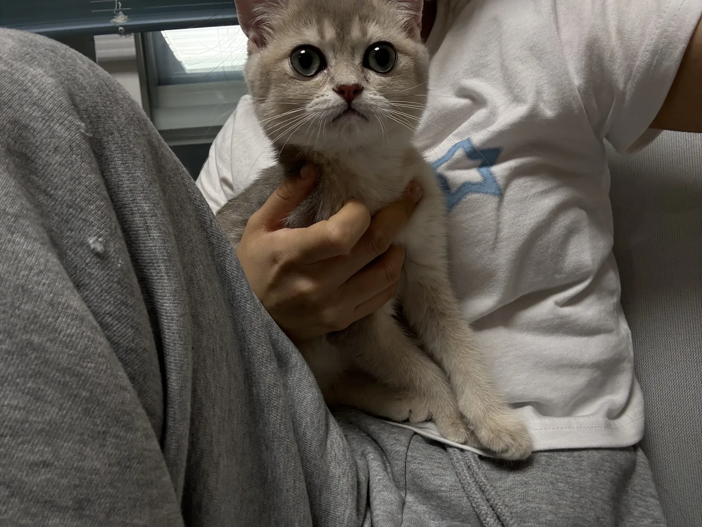 | 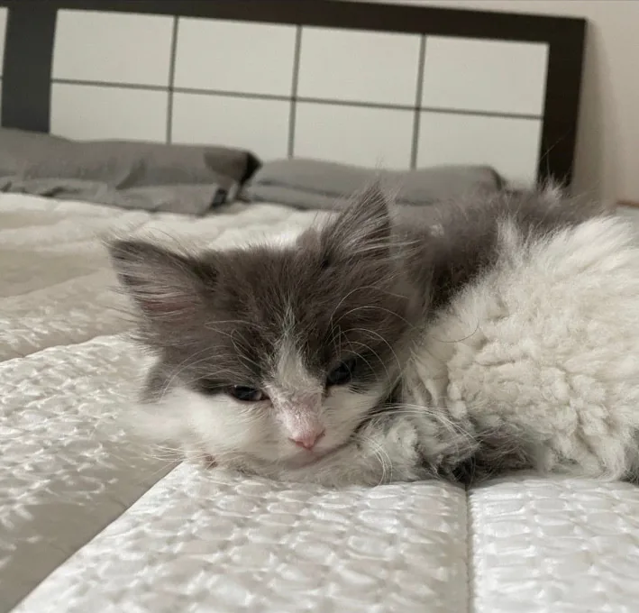 |
| De longs poils gris argenté et blancs, avec une grande queue en panache sans rayures. | Un chaton British Shorthair de cinq mois, gris taupe et crème, curieux de tout. | Notre bien-aimé Cho, parti bien trop tôt vers les étoiles des chats. Un chaton des forêts norvégiennes de seulement trois mois. |

## Installation rapide

### macOS / Linux

```bash
# Chapssari
curl -fsSL https://raw.githubusercontent.com/yeony-park/paws-on-codex/main/install.sh | bash -s -- chapssari

# Mandu
curl -fsSL https://raw.githubusercontent.com/yeony-park/paws-on-codex/main/install.sh | bash -s -- mandu

# Cho
curl -fsSL https://raw.githubusercontent.com/yeony-park/paws-on-codex/main/install.sh | bash -s -- cho
```

Afficher les compagnons disponibles :

```bash
curl -fsSL https://raw.githubusercontent.com/yeony-park/paws-on-codex/main/install.sh | bash -s -- --list
```

### Windows PowerShell

```powershell
# Chapssari
powershell -NoProfile -ExecutionPolicy Bypass -Command "& ([scriptblock]::Create((irm 'https://raw.githubusercontent.com/yeony-park/paws-on-codex/main/install.ps1'))) chapssari"

# Mandu
powershell -NoProfile -ExecutionPolicy Bypass -Command "& ([scriptblock]::Create((irm 'https://raw.githubusercontent.com/yeony-park/paws-on-codex/main/install.ps1'))) mandu"

# Cho
powershell -NoProfile -ExecutionPolicy Bypass -Command "& ([scriptblock]::Create((irm 'https://raw.githubusercontent.com/yeony-park/paws-on-codex/main/install.ps1'))) cho"
```

Le dossier par défaut est `~/.codex/pets/<pet-name>/`, ou son équivalent sous `CODEX_HOME`. Actualisez ou redémarrez Codex après l’installation.

<a id="meet-the-pets"></a>

## Découvrez les compagnons

| Chapssari | Mandu | Cho |
| --- | --- | --- |
|  |  | 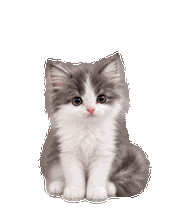 |
| Un chat des forêts norvégiennes au pelage gris argenté abondant, au large plastron blanc, aux yeux verts et à l’immense queue en panache sans rayures. | Un chaton British Shorthair curieux et énergique, gris taupe et blanc crème, aux yeux bleu-vert et à la silhouette compacte et ronde. | En mémoire de notre bien-aimé Cho, chaton des forêts norvégiennes gris et blanc, parti vers les étoiles des chats à seulement trois mois. |

## Galerie des animations

| Compagnon | Repos | Salut | Au travail | Attente de saisie | Révision |
| --- | --- | --- | --- | --- | --- |
| **Chapssari** | 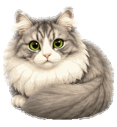 | 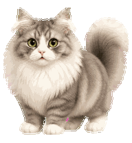 | 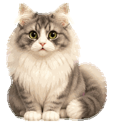 | 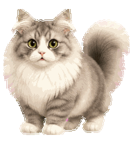 | 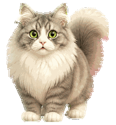 |
| **Mandu** | 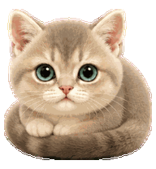 | 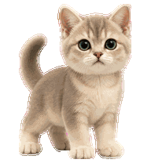 | 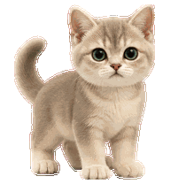 | 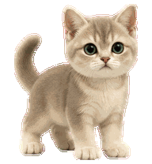 | 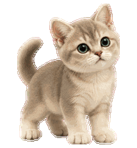 |
| **Cho** |  | 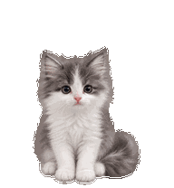 | 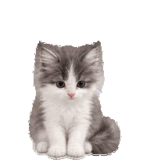 | 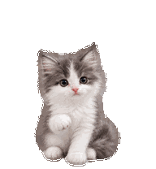 | 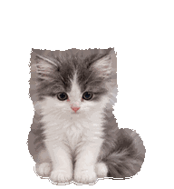 |

Chaque paquet v2 contient aussi les déplacements gauche/droite, les sauts, les réactions d’échec et 16 directions de regard.

## Import web · v1

Utilisez ces ZIP de compatibilité si l’importateur web accepte uniquement l’atlas v1 de 8×9 cases. Chaque archive contient seulement `pet.json` et `spritesheet.webp`.

- [Chapssari ZIP v1 pour import web](../../web-v1/chapssari-v1-web-upload.zip)
- [Mandu ZIP v1 pour import web](../../web-v1/mandu-v1-web-upload.zip)
- [Cho ZIP v1 pour import web](../../web-v1/cho-v1-web-upload.zip)

## Installer avec ChatGPT Work

Si ChatGPT Work peut accéder à GitHub et à votre environnement Codex local, transmettez-lui le dossier GitHub du compagnon v2 souhaité :

- [Chapssari dossier du compagnon v2](https://github.com/yeony-park/paws-on-codex/tree/main/pets/chapssari)
- [Mandu dossier du compagnon v2](https://github.com/yeony-park/paws-on-codex/tree/main/pets/mandu)
- [Cho dossier du compagnon v2](https://github.com/yeony-park/paws-on-codex/tree/main/pets/cho)

Collez cette consigne avec le lien du dossier :

```text
Installe ce paquet Codex Pet v2 depuis GitHub :
<PET_FOLDER_URL>

Utilise pet.json et spritesheet.webp tels quels. Installe-les dans le dossier pets
du CODEX_HOME actif (par défaut : ~/.codex/pets/<pet-id>/), conserve leurs noms,
valide le paquet et indique si Codex doit être actualisé ou redémarré.
Ne convertis pas en v1 et ne régénère ni ne modifie les images.
```

Il s’agit d’une procédure pratique, pas d’un plugin publié séparément. Les capacités de ChatGPT Work et les droits d’écriture locaux dépendent de l’environnement ; s’il ne peut pas écrire dans le dossier des compagnons, utilisez la commande d’installation ci-dessus.

## Présentez votre compagnon

Aucune planche de sprites terminée n’est nécessaire. Envoyez une présentation Markdown d’une ligne et, éventuellement, une photo :

1. Copiez [`community-pets/_template.md`](../../community-pets/_template.md) vers `community-pets/github-id--pet-name.md`.
2. Écrivez une ligne non vide de 180 caractères maximum.
3. Ajoutez éventuellement une photo JPG, PNG ou WebP dans `community-pets/photos-inbox/github-id--pet-name.<ext>`.
4. Ouvrez une pull request.

```markdown
**Bori** · dog/Jindo · [@github-id](https://github.com/github-id) — A four-year-old explorer who reaches the front door before anyone can pick up the walking bag.
```

Après fusion, l’automatisation supprime les métadonnées, redimensionne la photo, la convertit en WebP, efface l’original envoyé et actualise la [galerie communautaire](../../community-pets/GALLERY.md). Consultez [CONTRIBUTING.md](../../CONTRIBUTING.md) pour les droits, la confidentialité et les noms de fichiers.

## Créez votre compagnon avec Codex

Le dépôt contient la compétence de projet [`$create-companion-pet`](../../.agents/skills/create-companion-pet/SKILL.md). Ouvrez le dépôt dans Codex et demandez :

```text
Utilise $create-companion-pet pour transformer ces photos de mon animal en compagnon Codex.
```

La compétence rassemble les caractéristiques de l’animal, choisit le workflow installé adapté à la destination (`hatch-pet` pour Codex ou `work-pets:create-pet` pour ChatGPT Work), puis prépare les ressources v2 validées, un paquet web v1 et les métadonnées de contribution. Les compagnons déjà approuvés peuvent être importés sans régénérer leurs images. Le [guide de création et de révision](../../.agents/skills/create-companion-pet/references/creation-quality.md) traite de l’identité, des animations et du regard. Une consigne courte figure aussi dans [`prompts/create-your-pet.md`](../../prompts/create-your-pet.md).

## Structure du dépôt

```text
.
├── .agents/skills/create-companion-pet/
├── pets/
│   ├── chapssari/{pet.json,distribution.json,spritesheet.webp}
│   ├── mandu/{pet.json,distribution.json,spritesheet.webp}
│   └── cho/{pet.json,distribution.json,spritesheet.webp}
├── previews/
├── web-v1/
├── community-pets/
│   ├── photos-inbox/
│   └── photos/
├── docs/
├── scripts/
├── install.sh
├── install.ps1
├── CONTRIBUTING.md
├── LICENSE
└── ASSETS-LICENSE.md
```

## Remerciements

Merci à [`legeling/awesome-codex-pet`](https://github.com/legeling/awesome-codex-pet), dont la galerie par animation, l’installation en une commande et la distribution communautaire ont inspiré ce projet. L’implémentation actuelle a été écrite indépendamment. Si du code MIT de ce projet est intégré ultérieurement, ses mentions de copyright et d’autorisation devront être conservées selon [THIRD_PARTY_NOTICES.md](../../THIRD_PARTY_NOTICES.md).

## Contributeurs

Merci à toutes les personnes qui présentent un compagnon, améliorent une animation, traduisent la documentation ou aident à l’installation.

<a href="https://github.com/yeony-park/paws-on-codex/graphs/contributors">
  
</a>

## Star History

<a href="https://www.star-history.com/?type=date&repos=yeony-park%2Fpaws-on-codex">
 <picture>
   <source media="(prefers-color-scheme: dark)" srcset="https://api.star-history.com/chart?repos=yeony-park/paws-on-codex&type=date&theme=dark&legend=top-left&sealed_token=o0IJiSSZX6T_MmBNYLqJ4NVQ5LSJPV7KcZrQRvBzom2EZMf6_8yQlb5KTlqmi3jJ9_vl6ZBkzCBgLUTGhcH8u543gs1Oyt1eramLvwUjxTSXyd5et_iY7Sgkme5uIadIsm5yApWregMD-TtEdxAoaH-c9c8Sx4ZhMn4dQPlXtJ7BWwDqSl-IncLoZC5C" />
   <source media="(prefers-color-scheme: light)" srcset="https://api.star-history.com/chart?repos=yeony-park/paws-on-codex&type=date&legend=top-left&sealed_token=o0IJiSSZX6T_MmBNYLqJ4NVQ5LSJPV7KcZrQRvBzom2EZMf6_8yQlb5KTlqmi3jJ9_vl6ZBkzCBgLUTGhcH8u543gs1Oyt1eramLvwUjxTSXyd5et_iY7Sgkme5uIadIsm5yApWregMD-TtEdxAoaH-c9c8Sx4ZhMn4dQPlXtJ7BWwDqSl-IncLoZC5C" />
   
 </picture>
</a>

## Licence

- Code, scripts et documentation : [MIT](../../LICENSE)
- Logiciels tiers inclus : les conditions de chaque dépendance figurent dans [THIRD_PARTY_LICENSES.md](../../THIRD_PARTY_LICENSES.md).
- Ressources et aperçus de Chapssari, Mandu et Cho : [CC BY-NC 4.0](../../ASSETS-LICENSE.md)
- Photos et ressources communautaires : licence déclarée par leur contributeur ; CC BY-NC 4.0 n’est le choix par défaut que s’il possède les droits nécessaires et l’accepte.

Les noms et les représentations des animaux réels restent associés à leurs gardiens. Les photos de référence ne changent pas de licence sans inclusion et mention explicites.
